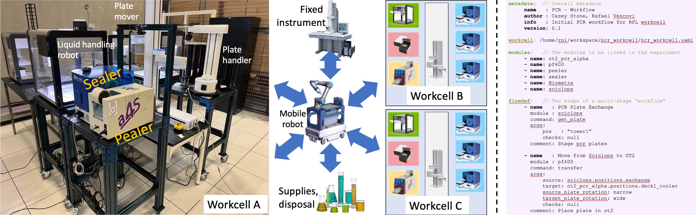

&#x1F34E;**Note for Raf**&#x1F34E;: There are some ???s below that would be good to fill in.

&#x1F34E;**Note for Raf**&#x1F34E;: We need an example that makes much clearer how we might do something. Maybe start with a simple example, like:
* Assume that we have an OT2 with red color in a well at position X and pure water in a well at position Y. We want to take 10 ml from each of X and Y and put it in a well in position Z. How do we specify this? I assume by writing a protocol file. Does the programmer generate the file and then call the WEI command?

&#x1F34E;**Note for Raf**&#x1F34E;: I use the term Cart (formerly, "module"), as the word "module" is used for something different in the code. Ok?


# Background on Workcells, Carts, Modules, and Workflows

In RPL we define standardized hardware and software configurations for robotic equipment and control software in order to simplify the assembly, modification, and scaling of experimental systems:
* A **cart** is a cart with zero or more modules 
* A **module** is an hardware component with a name, type, position, etc. (e.g., Pealer, Sealer, OT2 liquid handling robot, plate handler, plate mover, camera)
* A **workcell**, as show on the left of the image, is formed from multiple (8 in the photo on the left) carts that typically hold multiple modules (12 in the example, as described below).
* Multiple workcells and other components can be linked via mobile robots



An RPL "workflow" is a program to cause one or more actions to be performed on equipment within a workcell. It comprises two components:
* The **workcell definition** defines the modules that comprise a workcell, and associated static infrastructure that are to be used by the workflow
* The **workflow definition** defines the sequence of actions that are to be executed in order on the modules.

## Workcell definition

This is specified by a YAML file (e.g., [pcr_workcell.yaml](https://github.com/AD-SDL/rpl_workcell/blob/main/pcr_workcell/pcr_workcell.yaml)) comprising two sections, *config* and *modules*:

The **config** section defines various infrastructure services that may be used elsewhere in the workcell. For example, here is the config from the example just listed.

```
  ros_namespace: rpl_workcell                                 # ???
  funcx_local_ep: "299edea0-db9a-4693-84ba-babfa655b1be"      # UUID used for local computations
  globus_local_ep: ""                                         # 
  globus_search_index: "aefcecc6-e554-4f8c-a25b-147f23091944" # UUID for the Globus Search instance
  globus_portal_ep: "bb8d048a-2cad-4029-a9c7-671ec5d1f84d"    # ???
  globus_group: "dda56f31-53d1-11ed-bd8b-0db7472df7d6"        # ???
```

The **modules** section lists the *modules* that are included in the workcell. In the example just listed, there are 12 in total: 
* a [pf400 sample handler](https://preciseautomation.com/SampleHandler.html) (**pf400**) and two associated cameras, **pf400_camera_right** and **pf400_camera_left**; 
* a [SciClops plate stacker](https://hudsonrobotics.com/microplate-handling-2/platecrane-sciclops-3/) (**sciclops**)
* a XX (**sealer**) and a XX (**peeler**), with an associated camera, **sp_module_camera**
* three OpenTrons OT2 liquid handlers, **ot2_pcr_alpha**, **ot2_pcr_beta**, and **ot2_cp_gamma**;
* a [Biometra thermal cycler](https://www.analytik-jena.com/products/life-science/pcr-qpcr-thermal-cycler/thermal-cycler-pcr/biometra-trio-series/) (**biometra**)
* a ??? (**camera_module**)
           
Here is one of the 12 module specifications included in our example:

```
  - name: sealer                     # A name used for the module in the workflow: its "alias"
    type: wei_ros_node               # Indicates that module uses ROS2
    model: sealer                    # ???
    config:
      ros_node: "/std_ns/SealerNode" # ???
    positions:                       # One or more spatial locations, with name 
      default: [205.128, -2.814, 264.373, 365.863, 79.144, 411.553]
```

**NOTE**: Raf says "Each node defines its own protocols (ROS2, EPICS, TCP/IP, etc) and the variables necessary to interact with it (IP, PORT, NAME, ETC)" -- does any of that come up here? Is it the "type" that indicates ROS2?


## Workflow definition

This is specified by a YAML file that defines the sequence of actions that will be executed in order on the hardware. E.g., see [this example](https://github.com/AD-SDL/rpl_workcell/blob/main/pcr_workcell/workflows/ot2_test.yaml), shown also in the following, and comprising four sections:
* **metadata**: Descriptive metadata for the workflow
* **workcell**: The location of the workcell that the workflow is designed for
* **modules**: A list of the modules included in the workcell--just one here.
* **flowdef**: A list of steps, each with a name, module, command, and arguments.

```
metadata:
  name: PCR - Workflow
  author: Casey Stone, Rafael Vescovi
  info: Initial PCR workflow for RPL workcell
  version: 0.1

workcell: /home/rpl/wei_ws/demo/rpl_workcell/pcr_workcell/pcr_workcell.yaml

modules:
  - name: ot2_pcr_alpha

flowdef:
  - name: Mix OT2 reactions
    module: ot2_pcr_alpha
    command: run_protocol
    args:
      config_path: /home/rpl/wei_ws/demo/rpl_workcell/pcr_workcell/protocol_files/ot2_pcr_config.yaml
```

This workflow uses just one of the 12 modules defined in the workcell definition earlier, **ot2_pcr_alpha**, and comprises a single step, namely to run the "protocol" defined by the file [ot2_pcr_config.yaml](https://github.com/AD-SDL/rpl_workcell/blob/main/pcr_workcell/protocol_files/ot2_pcr_config.yaml). 
This file specifies a sequence of steps to be performed on the hardware.

> While a workflow and a protocol both specify a sequence of actions to be performed, they are quite different in role and syntax. A **workflow** uses a hardware-independent notation to specify actions to perform on one or more modules (e.g., action A1 on module M1, action A2 on module M2); a **protocol** uses a hardware-specific notation to specify steps to be performed on a single module (e.g., OT2). Why *workflow* and *protocol*? Perhaps because this technology was developed by a partnership of biologists ("protocol") and computer scientists ("module", "workflow").

## Protocols

A protocol file gives the device-specific instructions to be executed on a specific piece of hardware to implement an intended action. For example, [ot2_pcr_config.yaml](https://github.com/AD-SDL/rpl_workcell/blob/main/pcr_workcell/protocol_files/ot2_pcr_config.yaml) gives instructions for an OpenTrons OT2. A protocol file specifies a list of **equipment** within the hardware component; a sequence of **commands** to be executed on the equipment; and some describptive **metadata**. For example, the following shows the contents of [ot2_pcr_config.yaml](https://github.com/AD-SDL/rpl_workcell/blob/main/pcr_workcell/protocol_files/ot2_pcr_config.yaml), which comprise the equipment section, four commands, and the metadata section. 

```
equipment:
  - name: corning_96_wellplate_360ul_flat
    location: "1"
  - name: opentrons_96_tiprack_20ul #opentrons_96_tiprack_1000ul
    location: "8"
  - name: opentrons_96_tiprack_300ul
    location: "9"
  - name: p300_multi_gen2 #p1000_single_gen2
    mount: right

commands:
  - name: Make Master mix
    source: 1:[A1, A2, A3, A4]
    destination: 1:B1
    volume: [15, 100, 250, 300]
    mix_cycles: 1 
    mix_volume: 0
    
  - name: Combine forward primers
    source: 1:[D1]
    destination: 1:[C1]
    volume: [13]
    mix_cycles: 1 
    mix_volume: 0

  - name: Combine backward primers
    source: 1:[E1]
    destination: 1:[C1]
    volume: [13]
    mix_cycles: 1 
    mix_volume: 0

  - name: Combine DNA
    source: 1:[F1]
    destination: 1:[C1]
    volume: [13]
    mix_cycles: 1 
    mix_volume: 0
    
metadata:
  protocolName: PCR example template
  author: Kyle khippe@anl.gov
  description: Demonstration of PCR protocol for OT2
  apiLevel: "2.12"
```


&#x1F34E;**Note for Raf**&#x1F34E;: You write as follows, about the protocol file I think (?).  However, this is not clear to me, as I do not see any of the words that you list  (step name, robot, action name, vars) in the example, or anything that looks like a "funcx style message." (What is a "funcx style message"?)

This file uses the "alias" defined for each robot above and a funcx style message:
* Step Name: Name on the workflow
* Robot: Target Robot
* Action name: Action to be executed on the robot
* Vars: variable dictionary for that particular action

&#x1F34E;**Note for Raf**&#x1F34E;: To know how to generate these files, we need to understand what they mean. Some questions:
* What do the commands mean? E.g., what are C1, F1, etc. What does volume: [13] mean, what is a mix_cycle, etc. Is that documented anywhere?
