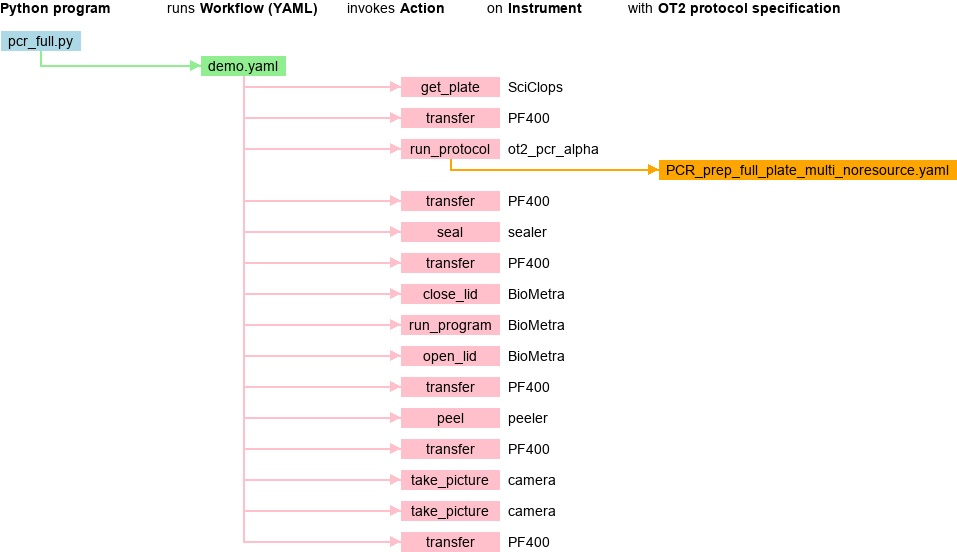

## Picture

Created with `python ../../draw_flow/draw.py -i pcr_full.json -o pcr_full.jpg`



## Initial setup
Before running the PCR workflow, visually check each machine in the workcell to ensure that it is powered on, and ready to perform its task in the workflow as follows

### Opentrons OT2 Beta
- Make sure OT2 Beta is turned on
- Make sure the OT2 has the proper labware configuration, and the correct amounts of reagents:

#### Opentrons Deck Positions
- Position 1: 96 well 100ul PCR full skirt plate
    - Forward primers (~20ul per well)
- Position 2: 96 well 100ul PCR full skirt plate
    - Reverse primers(~20ul per well)
- Position 3: Opentrons temperature module (turned on)
    - Target location for destination plate to be placed
- Position 4: 96 well 100ul PCR full skirt plate
    - Template DNA strands (~20ul per well)
- Position 5: Opentrons 10 tube rack nest 4 x 50mL, 6 x 15 mL conical
    - Position A1: BioWater (tube filled to 10 mL so that pipette doesn't get wet)
    - Position C2: Empty tube (to mix master mix in)
- Position 6: Opentrons 24 1.5mL snapcap eppendorf tuberack
    - Position A1: DNA polymerase (~40ul)
    - Position A3: Reaction Buffer (~1mL)
    - Position A5: DNTPs (~200 uL)
    - Position B3: GC Enhancer (~1mL)
- Position 7: Opentrons 20ul tiprack
- Position 8: Opentrons 20ul tiprack
- Position 9: Opentrons 300ul tiprack
- Position 10: Opentrons 20ul tiprack
- Position 11: Opentrons 20ul tiprack

- Left pipette: Opentrons p20 multi pipette gen 2
- Right pipette: Opentrons p300 single pipette gen 2

### Hudson Sciclops PlateCrane
- Check to see that there are enough PCR plates in Stack 4 (1 per run)
- Make sure plate exchange is clear

### Plate Sealer
- Make sure there are an adequate amount of seals on the roll
- Sealer is powered on
- Clear tray

### Plate Peeler
- See if there is an adequate amount of tape on the roll
- Peeler is powered on
- Clear tray

### Biometra Thermocycler
- Thermocycler is powered on (green light shown on front)
- Lid on thermocycler is open
- Thermocycler is clear


## Running the PCR Workflow

### Running ROS2 Nodes
In order to start the PCR Workflow, you should start ROS2 Nodes on "Parker" and "Strange" computers first. Currently, Parker is assigned to run the nodes for OT2, Sealer, Peeler, Biometra and Sciclops robots and "Strange" is assigned to run the nodes for PF400 robot and Camera Module. To start the nodes, follow the steps below.
### Start ROS2 Nodes on Strange
- Open a new shell and ssh into the Strange.
- Note: Password to Strange is ....

```
ssh rpl@146.137.240.63
./home/rpl/wei_ws/demo/rpl_workcell/scripts/run_nodes_strange.sh
```
### Start ROS2 Nodes on Parker
- Open a new shell and ssh into the Strange
- Note: Password to Parker is ....

```
ssh rpl@146.137.240.64
./home/rpl/wei_ws/demo/rpl_workcell/scripts/run_nodes_parker.sh
```

### Navigate in between TMUX shells
Once the TMUX session is started, you can navigate in between windows to check all the nodes. Number that correspond to the nodes are listed along bottom of the window.
- `Ctrl+B`
- `Desired window number`
- On Strange, available window numbers are: 0 and 1
- On Parker, available window numbers are: 0 to 6

If you know that TMUX session is running in the background, you can reopen the session on your shell with below commands.

- `tmux a`
- `Ctrl+B`
- `w`
- Choose the window you want to display
### Run PCR Campaign on your local computer
- Before running the PCR Campaign, check all the TMUX windows on both Parker and Strange to make sure all the robots are publishing "READY" state. If any of the robots are in "ERROR" state, refer to the DEBUGGING Section in the Template.
- Open a new shell on the local computer.
```
source /opt/ros/humble/setup.bash
source ~/wei_ws/install/setup.bash
./home/rpl/workspace/rpl_workcell/pcr_workcell/pcr_full.py
```

## Rviz Visualization
Real robot movements can be visualized in the RViz Visualization tool and can also be launched with the fake hardware without the movement feedback on the real robots.
- On a new shell execute the following command

### Launch with real robots
- `ros2 launch pcr_description pcr_workcell.launch.py`
### Launch with fake robot hardware
- `ros2 launch pcr_description pcr_workcell.launch.py fake_hardware:=True`


### DEBUGGING Robot Problems

#### PF400 issues
#### Sealer issues
- If there is a connection problem because of the wrong port. Run the following commands to find the correct port name.
- Kill the Sealer node with `Ctrl+C`.
- `sudo dmesg | grep tty`
- Restart the Sealer node.
- `ros2 launch a4s_sealer_client a4s_sealer_client.launch.py sealer_port:={Your Port Name}`
#### Peeler issues
- If there is a connection problem because of the wrong port. Run the following commands to find the correct port name.
- Kill the Sealer node with Ctrl+C.
- `sudo dmesg | grep tty`
- Restart the Peeler node.
- `ros2 launch brooks_peeler_client brooks_peeler_client.launch.py peeler_port:={Your Port Name}`
#### OT2 issues
- There are several actions on the OT2 which can only be completed through the Opentrons app on your personal computer. To do this, you need to physically plug you personal computer into the desired OT2. Some of these actions include:
    - Ending a running protocol prematurely
    - Recalibrating the OT2's pipettes
    - Checking the general health of the OT2
- If your OT2 is experiencing labware calibration issues, you can run a 'Labware position check' on the protocol you are trying to run, and input that data into your protocol.

#### Sciclops issues
#### Camera Module issues

#### Biometra Thermocycler issues
- If the Biometra Lid is initially closed before running the PCR protocol:
    - Navigate to the 'parker' computer
    - Navigate to biometra_module/biometra_driver/biometra_driver/
    - enter `python3`
    - ```from os import stat
        import clr
        from pathlib import Path
        import time as time


        dotnet_path = Path(__file__).resolve().parent / 'dotnet' / 'BiometraLibraryNet'
        clr.AddReference(str(dotnet_path))
        import BiometraLibrary
        ```
    - ```from biometra_driver.functions import Functions```
    - ```test = Functions()```
    - ```test.open_lid()```

#### Other issues
