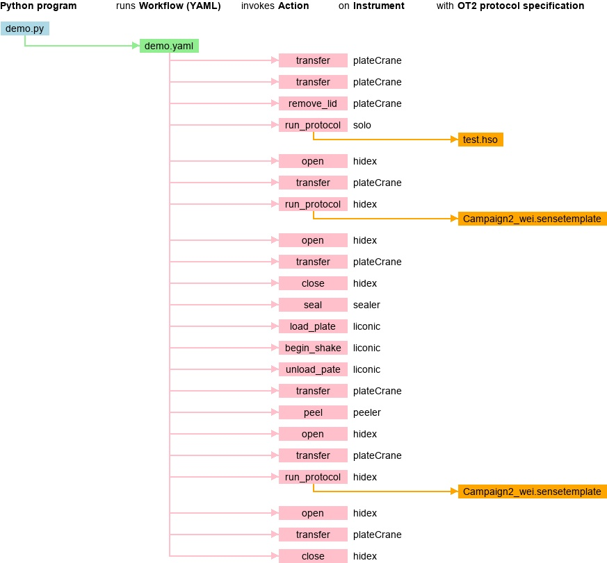

# Picture

Created with `python ../../draw_flow/draw.py -i demo.json -o demo.jpg`




# RPL Weekly Campaigns

## Initial setup 

TODO: Update for parker+strange+local

## Installing the nodes

TODO: Update for parker+strange+local


## Running the example

TODO: Update for parker+strange+local


## Running the Campaigns

For the PCR campaign:

```
source ~/wei_ws/install/setup.bash
./wc_client_run.py -wf workflows/pcr_workflow.yaml
```

For the Growth campaign:

```
source ~/wei_ws/install/setup.bash
./wc_client_run.py -wf /workflows/growth_workflow.yaml
```

For the MoveTest campaign:
```
source ~/wei_ws/install/setup.bash
./wc_client_run.py -wf /workflows/move_test.yaml
```


