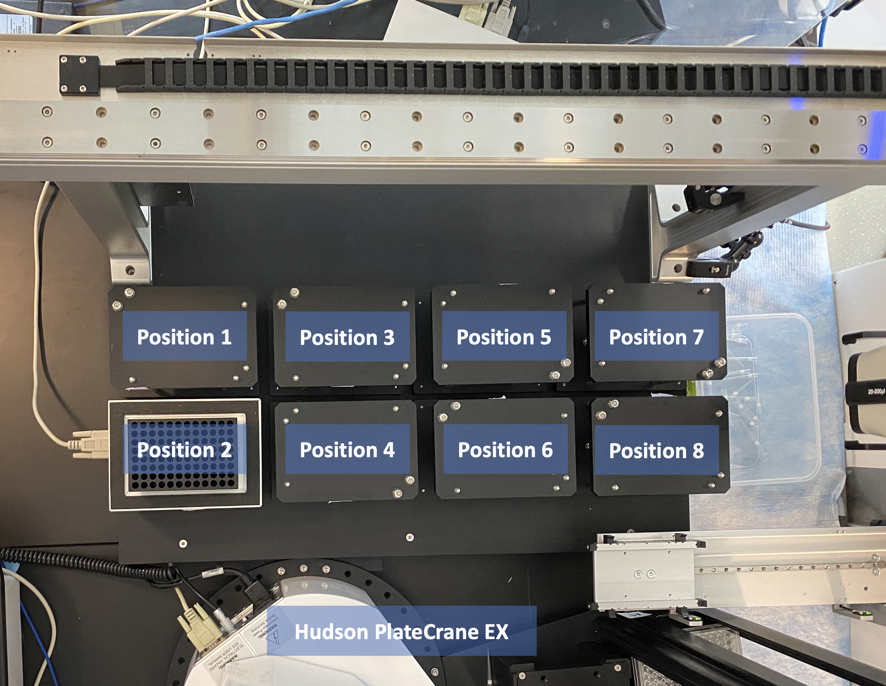
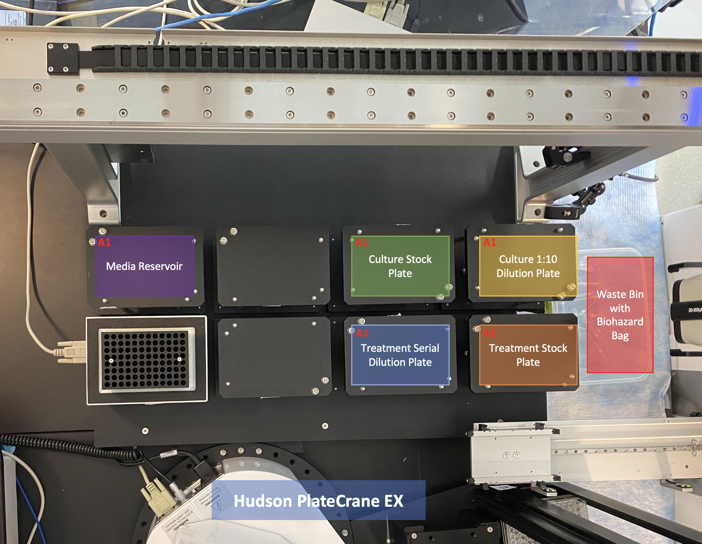
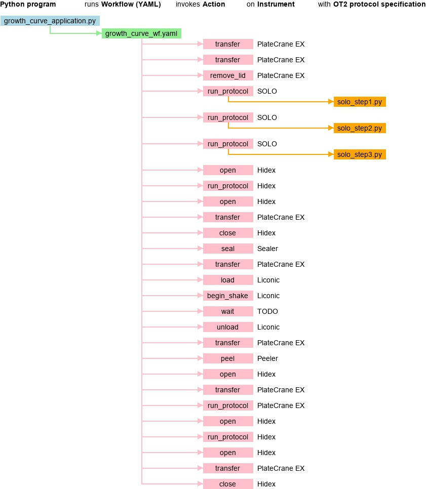

# Growth Curve WEI Workflow

## Initial Setup

Before running the Growth Curve workflow, visually check each machine in the bio workcell to ensure that it is powered on, and ready to perform its task in the workflow as follows. See documentation on the bio workcell (TODO: link)
### SOLO Liquid Handler
Our Hudson SOLO liquid handler was expanded to contain 8 deck positions, 7 of which are required for this growth curve workflow.

- Make sure the SOLO liquid handler is powered on and that the proper labware is placed on the SOLO deck as described below
-  (TODO: link to SOLO module description)
#### Deck Layout

<figure align="center">

<figcaption>Labware layout on SOLO at start of Growth Curve workflow</figcaption>
</figure>

 

<figure align="center">

<figcaption>Top-down view of SOLO deck positions 1 though 8</figcaption>
</figure>

- TODO: Photo of resource layout at start

- Position 1: Media stock plate
    - Example labware: Thermo Scientific™ Abgene™ 96 Well 2.2mL Polypropylene Deepwell Storage Plate
    - 2 adjacent columns filled with media per assay plate created
        (ex. media in columns 1 and 2 for 1 assay plate)

- Position 2: Heat Nest (EMPTY)
    - Note: Bio workcell contains a heat nest at SOLO deck position 2 but the heat nest is not required for this protocol

- Position 3: EMPTY at start
    - 180uL Filter Tip Box will be placed on this location by the plate crane at the start of the workflow
    - Example labware: Axygen™ Automation Tips - 180uL, sterile, filtered
    - 5 columns of tips used per assay plate created

- Position 4: EMPTY at start
    - an empty assay plate will be placed on this location by the plate crane at the start of the workflow

- Position 5: Culture stock plate
    - Example labware: Thermo Scientific™ Abgene™ 96 Well 2.2mL Polypropylene Deepwell Storage Plate
    - 1 column of cultured stock cells per assay plate created
    - Thaw plate before workflow begins if culture stock plate is taken from the freezer.

- Position 6: Treatment serial dilution plate
    - Example labware: Thermo Scientific™ Abgene™ 96 Well 2.2mL Polypropylene Deepwell Storage Plate
    - An empty half of treatment serial dilution plate is needed per assay plate created

- Position 7: Culture dilution plate
    - Example labware: Thermo Scientific™ Abgene™ 96 Well 2.2mL Polypropylene Deepwell Storage Plate
    - One empty column required per assay plate created

- Position 8: Treatment stock plate 
    - This labware contains the treatment which will be serial diluted and applied to the cells in the assay plate.
    - Thermo Scientific™ Abgene™ 96 Well 2.2mL Polypropylene Deepwell Storage Plate
    - One column of treatment stock plate used per assay plate created

### Plate Crane EX

(TODO: Photo/diagram of stacks at start of run)
#### Stack layout

- Stack 1: EMPTY at start 
    - Used assay plates will be stored here after the growth curve workflow is complete
- Stack 2: EMPTY at start 
    - Used tip boxes will be stored here after the growth curve workflow is complete
- Stack 3: EMPTY
- Stack 4: New 180uL tip boxes 
    - Axygen™ Automation Tips - 180uL, sterile, filtered
- Stack 5: Empty assay plates
    - Falcon™ 96-Well, Cell Culture-Treated, Flat-Bottom Microplate, Non-sterile

### Azenta Microplate Sealer

(TODO: link to sealer module setup and details)

Loaded Seal
- Azenta Gas Permiable Heat Seals (4ti-0598) 
https://www.azenta.com/products/gas-permeable-heat-seal

### Azenta Microplate Seal Remover (Peeler)
- Ensure the peeler is powered on and set up according to the instructions in the repo above. Check to make sure the Peeler is loaded with a tape roll and that there is enough tape to complete the workflow (2 peels required per assay plate created.
### LiCONiC StoreX STX88 Incubator

- TODO: Link to incubtor repo

- Ensure the incubator is powered on and set up according to instructions in the above repo.
    

## Workflow Details 

### Main Workflow Files  
- TODO: link to main workflow file 
- TODO: link to both yaml files
- TODO: link to all 3 hso creation files

### Workflow Steps 

<figure align="center">

<figcaption>Growth Curve workflow action sequence</figcaption>
</figure>

1. Plate Crane transfers new 180 uL tip box from Stack 4 to SOLO deck position 3
2. Plate Crane transfers new assay plate with lid from Stack 5 to SOLO deck position 4
3. Plate Crane removes lid from assay plate on SOLO deck position 4 and places it on Lid Nest 2
    - TODO: Diagram of Lid nest locations
4. SOLO liquid handler runs step 1 of assay plate prep
    - SOLO step 1: dilute cells and transfer to assay plate
        - Transfer 60uL media from 2 columns of media reservoir into each well of assay plate
        - Dilute specified column of stock cells from culture stock plate into one column of culture 1:10 dilution plate
        - Transfer 30uL of 1:10 diluted cells from culture 1:10 dilution plate into each well of assay plate
5. SOLO liquid handler runs step 2 of assay plate prep
    - SOLO step 2: prep treatment serial dilutions
        - Transfer media from two columns of media reservoir into specified half of treatment serial dilution plate
        - Transfer treatment from specified column of treatment dilution plate into first column (either 1 or 7) of specified half of treatment serial dilution plate
        - Serial dilute treatment from first column into all but last column of specified half of treatment serial dilution plate

6. SOLO liquid handler runs ste 3 of assay plate prep
    - SOLO step 3: transfer serial diluted treatment into assay plate
        - Transfer 90uL from each column of prepared treatment serial dilutions into each well in each half of assay plate, within each half working from lowest treatment concentration to highest. 
7. Hidex opens door 
8. Plate Crane transfers completed assay plate from SOLO deck position 4 to Hidex drawer
9. Hidex takes initial time 0 hour (T0) absorbance OD(590) readings of the assay plate
10. TODO: New Hidex data file is sent away for processing
11. Hidex opens door 
12. Plate Crane transfers assay plate from Hidex drawer to Sealer
13. Hidex closes door 
14. Sealer seals assay plate 
15. Plate Crane transfers assay plate from Sealer to Liconic Nest 
    - TODO: Photo of liconic nest (necessary?)
16. Liconic loads assay plate into specified stack and slot 
17. Liconic begins shaking 
18. Assay plate is incubated with shaking for 12 hours
19. Liconic unloads assay plate from specified stack and slot
20. Plate Crane transfers assay plate from Liconic Nest to Peeler 
21. Peeler peels assay plate
22. Hidex opens door
23. Plate Crane transfers assay plate from Peeler to Hidex drawer
24. Hidex takes final time 12 hour (T12) absorbance OD(590) readings of the assay plate 
25. Hidex opens door
26. Plate Crane transfers assay plate from Hidex drawer to Stack 1 (disposal)
27. Hidex closes door

    

    

