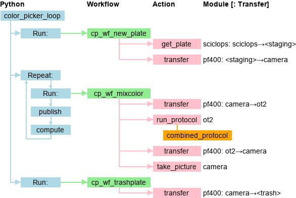

# Draw 

To produce a picture of a RPL workcell program:

`python draw.py -i <json>.json -o <file>.jpg`

For example:

`python draw.py -i ../color_picker/color_picker.json -o ../color_picker/color_picker.jpg`

Produces:

  
